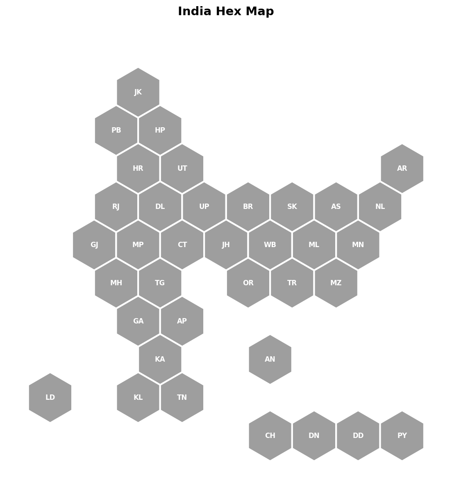

# india-hexmap

Draw a hex-tile map of India's 36 states/UTs, colored by any data you give it.
Hexagons are laid out so they share exact edges — no gaps, no overlaps.



*The map above with no data supplied — every hexagon just shows its code,
grey by default. Pass a `data` dict to `plot_hexmap()` to color them in.*

## Install

Locally, in editable mode (recommended while developing):

```bash
pip install -e .
```

Once published to PyPI:

```bash
pip install india-hexmap
```

## Usage — as a library

```python
import matplotlib.pyplot as plt
from india_hexmap import plot_hexmap

data = {
    "KL": 96.2, "MH": 84.8, "BR": 61.8, "UP": 67.7,
    # ... any subset of state codes; missing ones are drawn grey
}

fig, ax = plot_hexmap(data, cmap="YlGnBu", title="Literacy rate (%)",
                       colorbar_label="Literacy %")
plt.show()
fig.savefig("literacy.png", dpi=200)
```

### Categorical data

```python
results = {"UP": "Party A", "BR": "Party B", "MH": "Party A"}
fig, ax = plot_hexmap(results, categorical=True, title="2024 results")
```

### State codes

Import `POSITIONS` (grid coordinates) or `NAMES` (full names) if you need
the full list of valid codes:

```python
from india_hexmap import NAMES
print(NAMES)
```

All 36 valid codes:

| Code | State / UT | Code | State / UT |
|---|---|---|---|
| JK | Jammu & Kashmir | MH | Maharashtra |
| PB | Punjab | TG | Telangana |
| HP | Himachal Pradesh | OR | Odisha |
| HR | Haryana | TR | Tripura |
| UT | Uttarakhand | MZ | Mizoram |
| AR | Arunachal Pradesh | GA | Goa |
| RJ | Rajasthan | AP | Andhra Pradesh |
| DL | Delhi | KA | Karnataka |
| UP | Uttar Pradesh | AN | Andaman & Nicobar |
| BR | Bihar | LD | Lakshadweep |
| SK | Sikkim | KL | Kerala |
| AS | Assam | TN | Tamil Nadu |
| NL | Nagaland | CH | Chandigarh |
| GJ | Gujarat | DN | Dadra & Nagar Haveli |
| MP | Madhya Pradesh | DD | Daman & Diu |
| CT | Chhattisgarh | PY | Puducherry |
| JH | Jharkhand | | |
| WB | West Bengal | | |
| ML | Meghalaya | | |
| MN | Manipur | | |

## Usage — from the command line

```bash
india-hexmap data.csv --out map.png --cmap viridis --title "My Map"
```

`data.csv` needs two columns: `code,value`

```csv
code,value
KL,96.2
MH,84.8
BR,61.8
```

Add `--categorical` if `value` holds category labels instead of numbers.

## Publishing to PyPI (for you)

```bash
pip install build twine
python -m build
twine upload dist/*
```

You'll need a PyPI account and API token for the `twine upload` step.
